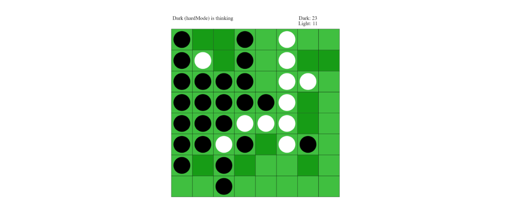

# Othello AI Technical Report

## Introduction

The Haskell program `AI.hs` contains several AIs which can decide where to place their pieces in an Othello game state. There are two main AIs: `greedy` and `default`.

- The `greedy` AI uses the function `easyMode`, which takes a game state and returns a move that can lead to a good next state.
- The `default` AI uses `hardMode`, which behaves like `easyMode` if the second argument is 1. Otherwise, it explores deeper game states and returns a move that may lead to a better future game state.

---

## Assumptions

Both AIs work based on the following assumptions:

- The AI is called only if it has any legal move.  
- The AI is called only if the game is not over.  
- The game board is 8×8.  
- The legal moves returned by the `legalMoves` function are indeed legal.

---

## Documentation

### `easyMode` and `hardMode`

- `easyMode`:
  - Processes input through `legalMove`, `filterMoves`, and `bestMove`.
  - `legalMove` returns a list of legal moves.
  - `filterMoves` removes obviously bad moves or keeps good ones (e.g., corners).
  - Refined list + current game state + `False` are passed to `bestMove`.

- `hardMode`:
  - Works like `easyMode`.
  - If second argument ≠ 1, it passes `True` to `bestMove` instead of `False`.

---

### `implementMove`, `getPlayer`, and `switchPlayer`

- `implementMove`: 
  - Applies a move via `applyMove` if legal; otherwise, returns the same state.

- `getPlayer`: 
  - Returns the current player for unfinished games. Returns `Player1` by default otherwise.

- `switchPlayer`: 
  - Switches the player in unfinished states. Returns unchanged state for finished games.

---

### `bestMove`, `scoreMove`, and `maxScoreMove`

- `bestMove`:
  - Chooses best move from a list.
  - If list has one move, returns it.
  - Otherwise, scores each move using `scoreMove`, then selects the max with `maxScoreMove`.

- `scoreMove`:
  - Applies move via `implementMove`.
  - If `False`, uses `stateEvaluatePlus` for a one-step evaluation.
  - If `True`, builds a depth-6 game tree using `othelloTree` and evaluates using `minimaxAB`.

---

### `minimaxAB`, `othelloTree`

- `othelloTree`:
  - Builds a game tree of given depth.
  - Swaps player at each level.
  - Adds an extra node if a skip turn is detected.

- `minimaxAB`:
  - Minimax with alpha-beta pruning.
  - Inputs: player, isMax, tree, alpha, beta.
  - Uses `stateEvaluate` at leaf nodes.
  - Updates:
    - Max nodes: max of child scores.
    - Min nodes: min of child scores.
    - Prunes branches when alpha > beta or beta < alpha.

---

### `stateEvaluatePlus`, `stateEvaluate`, `totalPieces`

- Both evaluation functions measure:
  - Piece count
  - Piece position
  - Piece stability
- `stateEvaluatePlus` (used by `greedy`) also considers mobility.
- `totalPieces`: counts pieces on board to adapt evaluation strategy depending on game stage.

---

### `positionScore`, `mobilityScore`, `stabilityScore`

- `positionScore`:
  - Uses a weight matrix (e.g., `scoreMatrix1`) to assign value to each piece.
  - Adds weight for own pieces, subtracts for opponent's.

- `mobilityScore`:
  - Based on number of legal moves.
  - Always negative (evaluates opponent’s mobility).

- `stabilityScore`:
  - Measures stable pieces.
  - Pieces on edges forming a line from a corner are counted.
  - Example shown below:

- Final score is passed back to `stateEvaluate` or `stateEvaluatePlus`, then to `bestMove`.

---

## Testing

- **`easyMode` and `hardMode`**:  
  Tested via unit tests with known good moves (e.g., corners) and through matches against phone app AIs.  

- **`bestMove`, `scoreMove`, `maxScoreMove`**:  
  Tested by comparing output to expected values via unit tests.

- **`othelloTree`**:  
  Visualized using a `show` function from `Nim.hs` by Antony Hosking.  
  Used `roseMap`, `getTurn`, and `roseDepth` to check depth, turn alternation, and skip-turn behavior.

- **`minimaxAB`**:  
  Compared results with a reference `miniMax` function.

- **Evaluation functions**:  
  Tested with hand-calculated scores on known game states.

---

## Reflection

- Started with `greedy` AI and ensured it could outperform `firstLegalMove` before building `default`.
- Added `filterMoves` to avoid bad moves (e.g., X-squares) and seize good opportunities (e.g., corners).
- Avoided using mobility in `default` to reduce evaluation complexity and allow deeper Minimax search.
- Challenges:
  - Avoiding C-squares when opponent pieces are nearby was not handled.
  - Evaluation function needs refinement for better long-term strategy.

---

## References

- Festa, J., & Davino, S. (2017). *IAgo Vs Othello: An artificial intelligence agent playing Reversi*. Retrieved from:  
  [https://courses.cs.washington.edu/courses/cse573/04au/Project/mini1/O-Thell-Us/Othellus.pdf](https://courses.cs.washington.edu/courses/cse573/04au/Project/mini1/O-Thell-Us/Othellus.pdf)

- Ganter, M., & Klink, J. (2004). *A New Experience: O-Thell-Us –An AI Project*. Retrieved from:  
  [https://courses.cs.washington.edu/courses/cse573/04au/Project/mini1/O-Thell-Us/Othellus.pdf](https://courses.cs.washington.edu/courses/cse573/04au/Project/mini1/O-Thell-Us/Othellus.pdf)

- Hosking, A. (2016). *Nim.hs*. Retrieved from:  
  [https://cs.anu.edu.au/courses/comp1100/lectures/10/](https://cs.anu.edu.au/courses/comp1100/lectures/10/)

---

## ⚖️ License & Academic Integrity

This project is licensed under **CC BY-NC-ND 4.0** (Attribution-NonCommercial-NoDerivatives).

### ⚠️ [IMPORTANT] For Current Students
This repository is for **reference and portfolio display only**. 

* **Zero-Access Policy:** If you are a current student at **The Australian National University (ANU)** enrolled in a course that utilises these or similar assignments, **you are strictly prohibited from viewing, downloading, or interacting with this repository.** Please close the repository immediately if it is similar to the work you are doing.
* **Copyright Notice:** All original code and reports are the intellectual property of the authors. All course-specific templates and task sheets belong to **The Australian National University (ANU)**.
* **Academic Honesty:** Copying or adapting any part of this code for your own university assignments is considered **academic misconduct**. 
* **Self-Reporting:** To ensure your own safety, if you have inadvertently viewed this code and it relates to your current coursework, you should close this repository immediately and consult your course convenor regarding academic integrity protocols.

> **Redistribution, commercial use, or modification is strictly prohibited without explicit consent.**